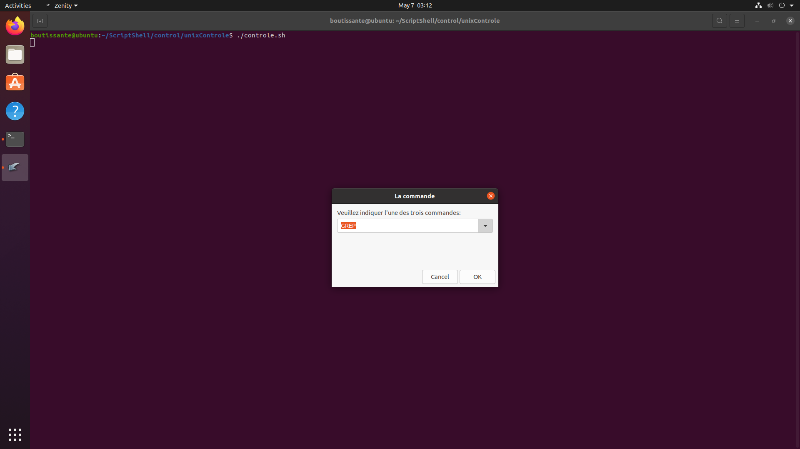
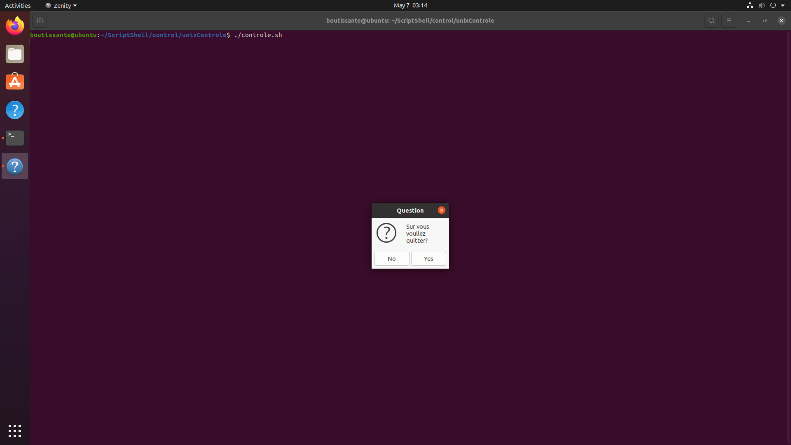
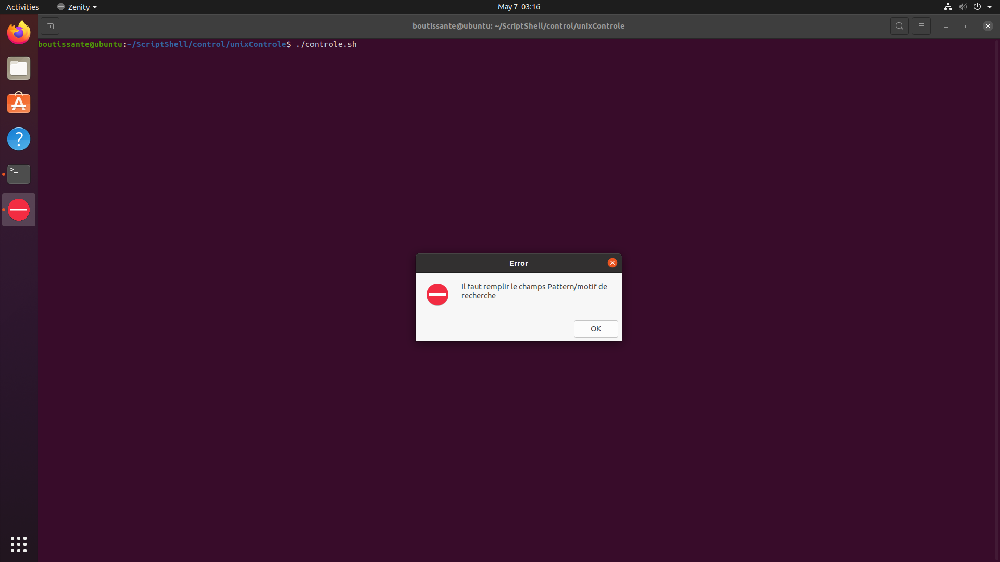
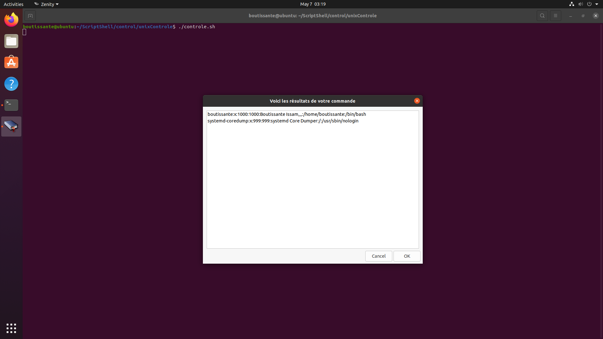
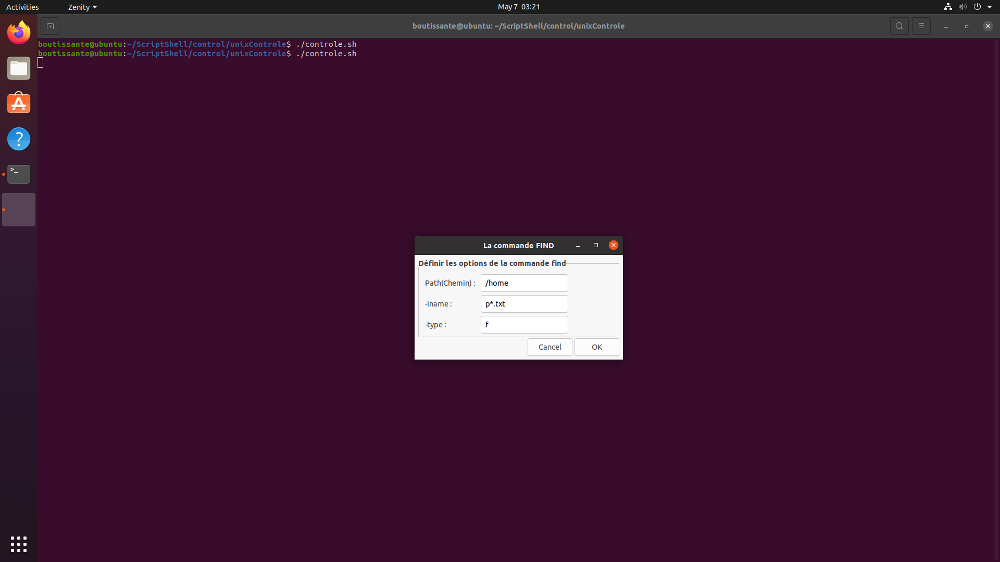
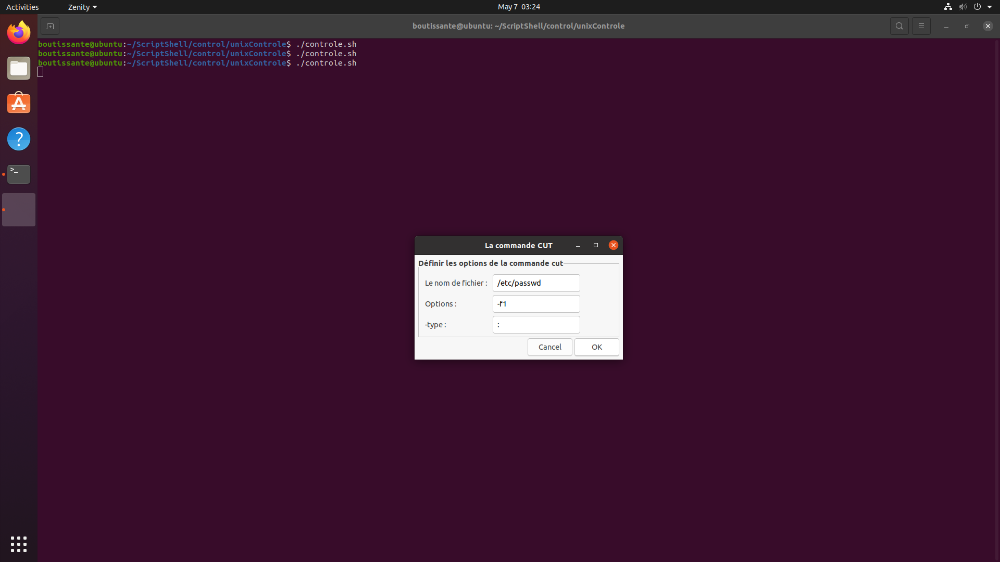
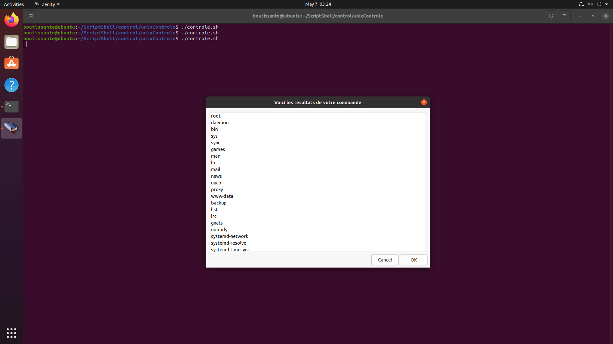

# Controle de Système d’exploitation 4

> **Realizer Par** :
>
> - _Mazzouz Chaimae_
> - _Boutissante Issam_

---

## 1.  _Première interface permet aux utilisateurs de sélectionner la commande dans une liste déroulante_

   ```bash
      selectCommand(){
         ans=`zenity --entry --title="La commande" --height=$height --width=$width\
            --text="Veuillez indiquer l'une des trois commandes:" --entry-text="GREP" FIND CUT`;
         if [ $? = 1 ];then
            if $(zenity --question --text "Sur vous voullez quitter?");then
               exit;
            else
               selectCommand
            fi
         fi
         if [ $ans = "FIND" ];then
            findCommand
         elif [ $ans = "CUT" ];then
            cutCommand
         elif [ $ans = "GREP" ];then
            grepCommand
         else
            zenity --error \
               --title="Error"\
               --text"Invalid Choix"
            selectCommand
         fi
      }
      selectCommand
   ```

   
   ## _Si l’utilisateur clique sur le bouton Annuler (Cancel) on va lui affichez une confirmation avant de quitter_
   

## 2. _Selon le choix de l’utilisateur on vas lui affichez une interfaces avec des zones à remplir._
   

## 3. _On va récupérez les données saisies par l’utilisateur, puis vérifiez si les options de la commande sans bien rempli ; sinon on va lui affichez un message d’erreur se forme d’une **boite de dialogue comme suite**_

```bash
   emptyError(){
      #on va pas valider les error des options ou des argument parce qu'il peut etre des error de permission
         #ou d'autres qu'il est mieux de les afficher au l'utilisateur
      zenity --error --width=300 --title="Error" --text="Il faut remplir le champs $1"
   }
```



## 4. _Lorse que la commande souhaitée a ete excecute on va affichez le résultat dans une fenêtre **(voir les examples suivantes)**_

## 5. _A l’aide de cet outil on va Affichez :_

   ### - _Les utilisateurs dont le nom UID entre 980 et 1005 en utilisant l'Expression Regulier (avc GREP) **`"^[^:]_\:[^:]_\:(9[8-9][0-9]|100[0-5])"`**_

   ```bash
      grepCommand(){
         #On crée le formulaire de GREP
         grepRes=`zenity --forms --height=$height --width=$width\
         --title="La commande GREP" \
         --text="Définir les options de la commande grep" \
         --add-entry="Pattern/motif de recherche :" \
         --add-entry="Path du fichier :" \
         --add-entry="Nom du fichier :" \
         --separator="~"`
         #il faut utiliser ~ comme separteur pour eviter les error de Regex et aussi de savoir si les champs vide
         #pour le button Cancel on va quetter
         if [ $? = 1 ];then
               exit
         fi
         pattern=$(echo $grepRes | cut -d"~" -f1)
         pathFichier=$(echo $grepRes | cut -d"~" -f2)
         nomFichier=$(echo $grepRes | cut -d"~" -f3)
         if [ -z $pattern ];then
               emptyError "Pattern/motif de recherche"
               grepCommand
         elif [ -z $pathFichier ];then
               emptyError "Path du fichier"
               grepCommand
         elif [ -z $nomFichier ];then
               emptyError "Nom du fichier"
               grepCommand
         fi
         egrep "$pattern" $pathFichier/$nomFichier &> res.txt
      }
   ```

   
   ### _Le Resultat_

   ### - _Les fichiers dont l’extension est .txt et commencent par un ‘p’ dans votre /home (avec FIND)_

   ```bash
      findCommand(){
         #On crée le formulaire de FIND
         findRes=`zenity --forms --height=$height --width=$width\
         --title="La commande FIND" \
         --text="Définir les options de la commande find" \
         --add-entry="Path(Chemin) :" \
         --add-entry="-iname :" \
         --add-entry="-type :"`
         #pour le button Cancel on va quetter
         if [ $? = 1 ];then
               exit
         fi

         Path=$(echo "$findRes" | cut -d"|" -f1)
         Iname=$(echo "$findRes" | cut -d"|" -f2)
         Type=$(echo "$findRes" | cut -d"|" -f3)
         #valider c'est les champs sont rempli
         if [ -z $Path ];then
            emptyError "Path(Chemin)"
            findCommand
         elif [ -z $Iname ];then
            emptyError "-iname"
            findCommand
         elif [ -z $Type ];then
            emptyError "-type"
            findCommand
         fi
         find $Path -type $Type -name "$Iname" &> res.txt
      }
   ```

   
   ### _Le Resultat_
   

   ### - _Les noms des utilisateurs dans votre machine (avec CUT)_

   ```bash
      cutCommand(){
         #On crée le formulaire de CUT
         cutRes=`zenity --forms --height=$height --width=$width\
         --title="La commande CUT" \
         --text="Définir les options de la commande cut" \
         --add-entry="Le nom de fichier :" \
         --add-entry="Options :" \
         --add-entry="-type :"`
         #pour le button Cancel on va quetter
         if [ $? = 1 ];then
               exit
         fi

         fileName=$(echo "$cutRes" | cut -d"|" -f1)
         optionCut=$(echo "$cutRes" | cut -d"|" -f2)
         typeCut=$(echo "$cutRes" | cut -d"|" -f3)
         if [ -z $fileName ];then
               emptyError "Le nom de fichier"
               cutCommand
         elif [ -z $optionCut ];then
               emptyError "Options"
               cutCommand
         elif [ -z $typeCut ];then
               emptyError "-type"
               cutCommand
         fi

         cut -d"$typeCut" $optionCut $fileName &> res.txt
      }
   ```

   
   ### _Le Resultat_
   

   ### - _Pour Afficher Le resultat_

   ```bash
       zenity --text-info --width="700" --height="500"\
       --title "Voici les résultats de votre commande"\
       --filename "res.txt"
   ```

> Vous pouvez voir le scirpt **controle.sh**
